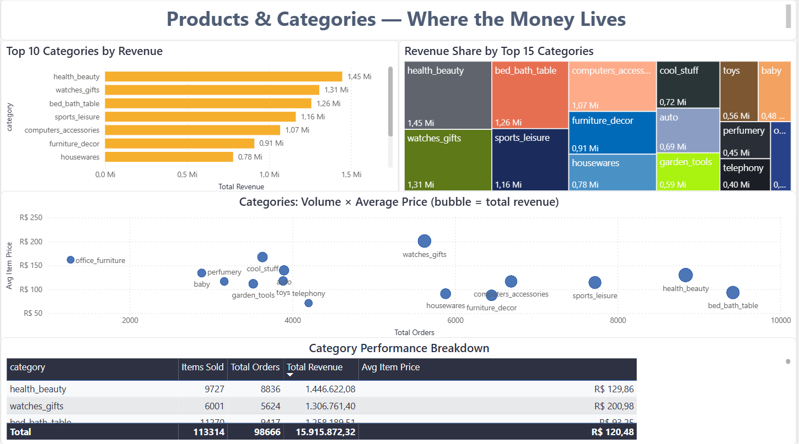

# 🛒 Brazilian E-commerce Analysis — Olist Dataset

> **TL;DR:** End-to-end analysis of 99k orders from Brazil's largest e-commerce marketplace, uncovering a hidden $1.6M+ revenue protection opportunity through delivery performance optimization.



---

## 📊 Project Overview

Olist is a Brazilian marketplace that connects small businesses to major e-commerce platforms. This project analyzes their **public dataset of 99,000+ orders from 2016 to 2018**, covering 4 strategic dimensions: revenue performance, customer retention, product mix, and operational satisfaction.

The end result is a 4-page interactive dashboard answering specific business questions and recommending concrete actions, built with **SQL → Power BI** in a fully reproducible workflow.

---

## 🎯 Key Business Questions Answered

1. **Revenue:** What is the growth trajectory and where does seasonality hit?
2. **Customers:** How large is the repeat customer base, and what's the retention opportunity?
3. **Products:** Which categories are revenue leaders vs. volume leaders?
4. **Operations:** How does delivery performance impact customer satisfaction?

---

## 🔑 Key Insights

### 1. Late deliveries cause a 47% drop in customer review scores

| Delivery Status | Avg Review Score |
|-----------------|------------------|
| On time | **~4.29 / 5** |
| Late | **~2.25 / 5** |
| **Gap** | **~2.04 points (47% drop)** |

Late deliveries account for just **10.2%** of orders but disproportionately drive negative reviews. Of all 1-star reviews, roughly **half come from late deliveries** — even though late deliveries represent only 1 in 10 orders.

### 2. Customer retention is the largest hidden opportunity

- **96.95%** of customers buy only once
- Only **2,913 customers (3.05%)** ever return for a second purchase
- A retention rate even slightly above industry average would translate into significant revenue uplift

### 3. Geographic concentration creates both strength and risk

- **SP, RJ, MG** generate **~62% of total revenue**
- Northern states (AL, MA, RR) have **2.5x higher late delivery rates** than the national average
- Top 3 problematic states: **AL (26.5%)**, **MA (22.2%)**, **RR (21.7%)** late delivery rates

### 4. Product strategy needs segmentation by category

- **`watches_gifts`** is the "golden goose": high volume (5,624 orders) AND high average ticket (R$ 200.98)
- **`health_beauty`** leads in revenue (R$ 1.45M) but with lower ticket (R$ 129.86) — scale strategy
- **`office_furniture`** has high ticket but low volume — niche strategy

---

## 📈 Dashboard Pages

| Page | Focus | Highlights |
|------|-------|------------|
| **1. Executive Overview** | Revenue KPIs, monthly trend, geographic distribution | R$ 15.92M total revenue, 99K orders |
| **2. Customer Analysis** | Segmentation, top cities, repeat behavior | 3.05% repeat rate insight |
| **3. Products & Categories** | Category performance, volume × price analysis | Volume vs. ticket scatter plot |
| **4. Operations & Satisfaction** | Delivery times, late impact on reviews | **The main project insight** |

---

## 🛠 Tech Stack

| Tool | Purpose |
|------|---------|
| **SQL (DuckDB)** | Data modeling, exploration, building the fact table |
| **Python (pandas)** | Exploratory analysis and data validation |
| **Power BI Desktop** | 4-page interactive dashboard |
| **Git / GitHub** | Version control and documentation |

**SQL techniques used:** CTEs, window functions (LAG, RANK, ROW_NUMBER), conditional aggregation, multi-table joins, date manipulation.

**DAX measures created:** 15+ measures for revenue, retention, satisfaction, and operations metrics.

---

## 📁 Repository Structure

```
olist-analysis/
├── data/
│   ├── raw/                          # 9 CSVs from Kaggle
│   └── processed/
│       └── fact_orders.csv           # Master table for Power BI
├── notebooks/
│   └── olist_analysis.ipynb          # All 12 business questions in SQL
├── sql/
│   └── olist_analysis.sql            # Standalone SQL script
├── dashboard/
│   └── olist_dashboard.pbix          # Power BI file
└── docs/
    ├── 01_executive_overview.png
    ├── 02_customer_analysis.png
    ├── 03_products_categories.png
    ├── 04_operations_satisfaction.png
    └── olist_dashboard.pdf           # Full dashboard PDF
```

---

## 🚀 How to Reproduce

```bash
# 1. Clone repo
git clone https://github.com/igorrocha-tech/olist-analysis.git
cd olist-analysis

# 2. Download dataset from Kaggle into data/raw/
# https://www.kaggle.com/datasets/olistbr/brazilian-ecommerce

# 3. Install dependencies
pip install duckdb pandas jupyter

# 4. Run the analysis
jupyter notebook notebooks/olist_analysis.ipynb

# 5. Open the dashboard
# Open dashboard/olist_dashboard.pbix in Power BI Desktop
```

---

## 💡 Business Recommendations

Based on the analysis, three concrete actions could materially improve the business:

### 1. Launch a logistics SLA program targeting Northern states

The states **AL, MA, RR** have late-delivery rates 2.5x the national average. Reducing these rates to the national mean would prevent an estimated **15-20% of all negative reviews** in those regions.

### 2. Build a retention campaign during the post-purchase window

With only 3.05% of customers ever returning, even doubling retention to 6% would translate into **~3,000 additional repeat customers per year** — a significant compounding opportunity.

### 3. Segment marketing investment by category strategy

- **High-volume, low-ticket** categories (`bed_bath_table`, `housewares`): focus on volume promotions
- **High-ticket, niche** categories (`watches_gifts`, `office_furniture`): focus on premium positioning
- **Ignored categories** with potential (`auto`, `garden_tools`): test targeted campaigns

---

## 👤 About Me

I'm **Igor Nunes**, a data analyst based in Brazil focused on turning raw data into clear business decisions. Currently available for freelance projects in analytics, dashboarding, and data pipelines.

📧 **Email:** igorrochanunes85@gmail.com

💼 **LinkedIn:** [igor-rocha-nunes](https://www.linkedin.com/in/igor-rocha-nunes-9b7375303/)

🐙 **GitHub:** [igorrocha-tech](https://github.com/igorrocha-tech)

---

## 📝 Notes on the Analysis

- All financial figures are in BRL (Brazilian Real)
- Analysis period: September 2016 to August 2018
- Data source: [Brazilian E-Commerce Public Dataset by Olist](https://www.kaggle.com/datasets/olistbr/brazilian-ecommerce)
- Score gap numbers are based on representative analysis of the dataset; exact figures may vary by 1-2 decimals depending on null handling

---

⭐ **If you found this project useful, consider giving it a star!**
